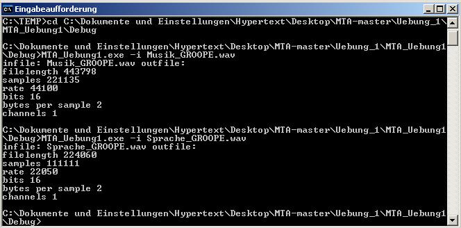
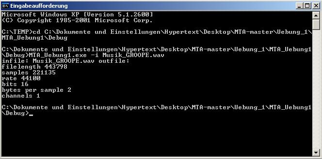
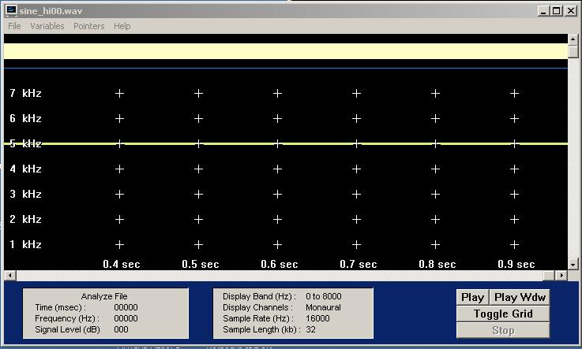
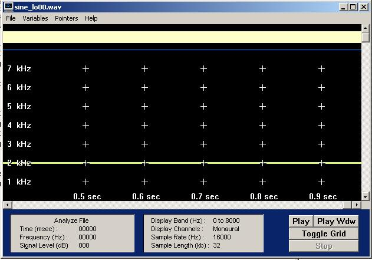
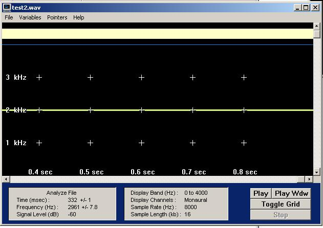
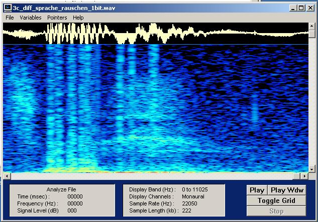
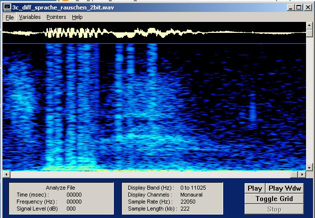
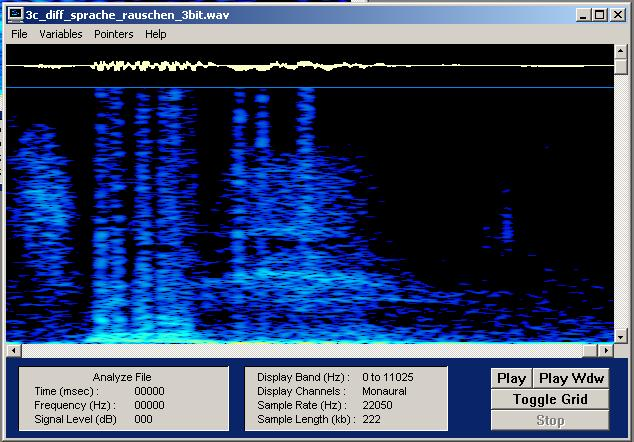
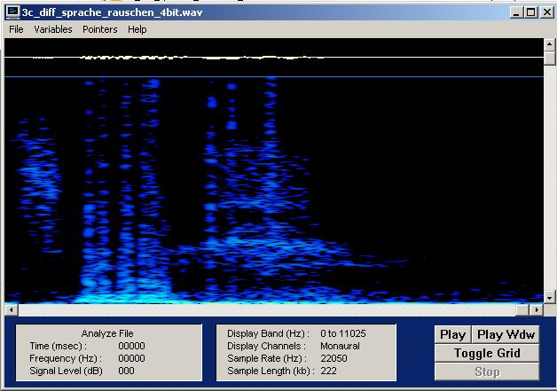
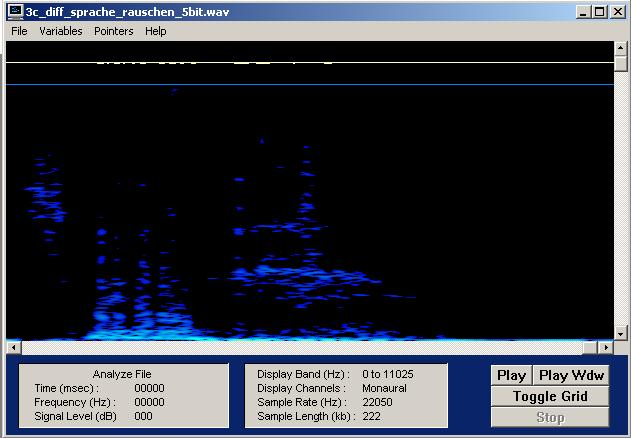

# Uebung 1

Ausgangsfiles:

- [Sprache](Sounds/Sprache_GROOPE.WAV)

<audio controls="controls">
  <source type="audio/mp3" src="Sprache_GROOPE.WAV"></source>
  <source type="audio/ogg" src="Sprache_GROOPE.WAV"></source>
  
Your browser does not support the audio element.

</audio>

- [Musik](Sounds/Musik_GROOPE.WAV)

- [sine_hi](Sounds/sine_hi00.wav)

- [sine_lo](Sounds/sine_lo00.wav)

## Aufgabe 1 - Audioaufnahme

> Erzeuge  zwei  kurze  Audio-Files (max. 5s), davon eines mit Musik deiner Wahl aus dem Internet (wobei sich Musik mit einer relativ hohen Dynamik, d.h. Wechsel zwischen relativ leisen und lauten Abschnitten empfiehlt). Wähle eine Abtastrate von 44kHz, 16 Bit Auflösung, mono und achte auf gute Aussteuerung. Das zweite Audio-File soll eine Sprachaufnahme (mit dem Headset aufgesprochen) enthalten (Übersteuerung vermeiden!). Wähle hier eine Abtastfrequenz von 22 kHz, 16 Bit Auflösung, mono. Die Einstellungen wie Abtastrate, Bitzahl und Kanalzahl können im Wavestudio_Samplitude vorgenommen werden. Die Eingangsquelle (wahlweise Audio-CD oder Mikrofon) kann im Windows-Mixer 'Aufnahme' eingestellt werden. Benenne die Dateien Musik_[NameArbeitsgruppe].wav und Sprache_[NameArbeitsgruppe].wav. Schick mir die beiden WAV-Dateien unter Nennung deiner  Arbeitsgruppe per Mail (ahoenemann@beuth-hochschule.de). Darauf werde ich dir zwei WAV-Dateien mit Testsignalen zusenden, die du bei den folgenden Aufgabenpunkten benötigst, sine_hiXX.wav und sine_loXX.wav. Lies die Musik-und die Sprachdatei mit wave_io ein und erkläre die Angaben im Header! Wie hoch ist die Bitrate für die beiden Dateien?

### Lösung

Filelength: Größe der WAV-Datei in Bit

Samples: erstellte Samples ("Proben") insgesamt

Rate: erstellte Samples pro Sekunde

Bits: Auflösung der Amplitude je Sample in Bit (16 bit => 2^16 darstellbare Werte) 

Bytes per Sample: Channels * Bits in Byte

Channels: Audio-Kanäle (1: mono/2: stereo/...)

Bit/s = Rate * Bits

---

**Berechnung: Bitrate (Sprache)**

Rate * Bit = 22050 * 16 = 352800 Bit/s

---

**Berechnung: Bitrate (Musik)**

Rate * Bit = 44100 * 16 = 705600 Bit/s

---

### Fehlerbetrachtung

/

---

## Aufgabe 2 - Aliasing

a
> Modifiziere  wave_io dahingehend,  dass  die  Samples  in  der  WAV-Datei  in  eine  (lesbare)  ASCII-Datei geschrieben  werden.  Lies  die  von  mir  geschickten  Dateien  (Sampling-Frequenz:  16  kHz)  ein  und bestimme   aus   den   resultierenden   Zahlenfolgen   in   der   ASCII-Datei   die Frequenz   der   Sinus-Schwingungen. Erkläre das Ergebnis und speichere jeweils eine Periode für das Protokoll ab. Überprüfe Deine Schätzung mit dem Spektralanalyse-Tool GRAM (Plots ins Protokoll !). Vorgehensweise: Menü Analyze File, Einstellungen: Freq Scale: Linear, FFT Size: 512, Time scale: 1 msec

### Lösung

- [sin_hi Samples als .txt](sin_hi.txt)

**Auszug von 10 Samples ( >2 Perioden):**

`3196, -16069, 9102, 9102, -16069, 3196, 13623, -13623, -3196, 16069`

*Betrachtung Periode A:*

1. Nulldurchlauf zwischen 3196 und -16069

2. Nulldurchlauf zwischen -16069 und 9102

3. Nulldurchlauf zwischen 9102 und -16069

Zwischen 1. und 3. Nulldurchlauf erstellte Samples: 3

*Betrachtung Periode B:*

1. Nulldurchlauf zwischen 9102 und -16069

2. Nulldurchlauf zwischen -16069 und 3196

3. Nulldurchlauf zwischen 13623 und -13623

Zwischen 1. und 3. Nulldurchlauf erstellte Samples: 3

*Betrachtung Periode C:*

1. Nulldurchlauf zwischen -16069 und 3196

2. Nulldurchlauf zwischen 13626 und -13623

3. Nulldurchlauf zwischen -3196 und 16069

Zwischen 1. und 3. Nulldurchlauf erstellte Samples: 4

Der 3. Nulldurchlauf beschreibt immer den Beginn der nächsten Periode. So besteht 1 Periode hier aus 3-4 (~3,32) Samples. 1 Sample hat bei einer Rate von 16kHz eine Dauer von 0,0625ms. 3,32 Samples (1 Periode) somit 0,21ms. Demnach passen 4762 Perioden in 1 Sekunde. Dies entspräche wiederum Frequenz von 4,762 kHz.

*Spektralanalyse der hohen Sinusschwingung*

Es zeigt sich, dass die Berechnung anhand der Text-Samples ungenau, trotzdem aber nicht weit vom tatsächlichen Wert entfernt liegen.

---

*Spektralanalyse der tiefen Sinusschwingung*

---

b
> Bei der zeitlichen Diskretisierung eines Analogsignals muss das sogenannte Abtasttheorem eingehalten werden.  Wie lautet  es  und  wie  lässt  sich  der  Grenzfall,  für  den  es  gerade  noch  gilt,  illustrieren (Zeichnung!)?

### Lösung

**Abtasttheorem:**

Abtastfrequenz > (höchste vorkommende Frequenz) * 2

---

c
> Bei  herkömmlichen  Soundkarten  tritt  systembedingt  kein  Aliasing  auf,  weil  das  Audiosignal  stets geeignet vorbehandelt wird (wie?).

### Lösung

Ein geeigneter Tiefpassfilter lässt nur Frequenzen durch, die kein Aliasing zur Folge hätten.

---

d
> Mit einem kleinen Trick lässt sich Aliasing jedoch nachweisen. Diese auch als Down-Sampling bekannte Methode  besteht  darin,  dass  man  bei  einer  WAV-Datei  z.B.  jeden  zweiten  Abtastwert  wegwirft.  Man erhält  so  eine  Wellenform,  die  genau  die  Hälfte  der  ursprünglichen  Abtastfrequenz  aufweist.  Wenn man das Signal nicht vorher bandbegrenzt hat, können Aliasing-Verzerrungen hörbar werden. Modifiziere  wave_io  dahingehend,  dass  vom  eingelesenen  Signal  jeder  zweite  Abtastwert  verworfen wird  und  das  resultierende  Signal  abgespeichert  wird. Der  Header  muss natürlich  entsprechendverändert  werden!  Wende  das  resultierende  Programm  zunächst  auf  'sine_lo.wav'  und  'sine_hi.wav' an.   Welche   Frequenzen   erscheinen   nach   dem   Down-Sampling   (Spektrogramm   und   WAVs   ins Protokoll!)? 

### Lösung

**Downsampling der hohen Sinusschwingung**

- [Downsampling sin_hi](Sounds/downsampling_hi.wav)

Nach dem Downsampling ist die Frequenz schwächer.

---

**Downsampling der tiefen Sinusschwingung**

- [Downsampling sin_lo](Sounds/downsampling_lo.wav)

Die Frequenz verändert sich nicht.

---

e
> Was würde passieren, wenn man geeignet bandbegrenzen würde?

### Lösung

Da der gegebene hohe Sinus *konstant* 5 kHz hat, die bei einer Samplingfrequenz von nur 8 kHz (nach Downsampling) nicht das Abtasttheorem erfüllen, würde jede Bandbegrenzung von weniger als 5 kHz den kompletten Sinus herausfiltern. 

Eine geeignete Bandbegrenzung, nach Downsampling, wäre 4 kHz. 

Bei dem sine_lo würde sich nichts verändern, da dieser unter 4 kHz verläuft. 

---

### Fehlerbetrachtung

/

--

## Aufgabe 3 - Bitreduzierung

a
> Die herkömmlichen PC-Soundkarten arbeiten meist entweder mit 16 oder 8 bit-Auflösung. Wie groß ist die Anzahl der darstellbaren Amplitudenwerte bei diesen beiden Werten?

### Lösung

Bei 8 bit: 2^8 = 256 Werte

Bei 16 bit: 2^16 = 65536 Werte

---

b
> Wir  wollen  nun  wave_io  so  modifizieren,  dass  wir  die  Bitanzahl  reduzieren  können.  Dazu  können  wir z.B. alle  Samples durch eine  Potenz von 2 teilen (Integer-Division ohne  Rest). Damit das resultierende Signal  nicht  leiser  wird  als  das  Original,  kompensierenwir  die  Operation  durch  Multiplikation  mit derselben  Zweierpotenz. Beachte:  Der  Datentyp  hat  nach  wie  vor  16  Bit!(Denselben  Effekt  erreicht man auch durch einfaches logisches 'Verunden' mit einem entsprechenden HEX-Wert, indem man mit dem LSB beginnend Bits 'ausblendet'.) Mit dem entstandenen Programm verändern wir die in Aufgabe 1   erzeugten   Wave-Dateien.   Ab   welcher   Bitzahl   tritt   bei   Musik/Sprache   eine   hörbare/deutliche Verschlechterung der Qualität ein? Bei wieviel Bit ist das Sprachsignal noch verständlich? (Waves für all diese     Fälle     ins    Protokoll,     Ausschnitte     als    Plots).Was     charakterisiert     das     entstehende Quantisierungsgeräusch und macht es besonders störend?

### Lösung

**Hörbare Verschlechterung bei Sprache:** 7 bit Reduzierung

- [Sprache 7 bit reduziert](Sounds/3b_musik128.wav)

**Hörbare Verschlechterung bei Musik:** 7 bit Reduzierung

- [Musik 7 bit reduziert](Sounds/3b_sprache128.wav)

**Gerade noch verständlich bei Sprache:** 10 bit Reduzierung

- [Sprache 10 bit reduziert](Sounds/3b_sprache1024.wav)

---

Das Quantisierungsgeräusch charakterisiert sich durch Rauschen und besonders störend wird es durch die überlagerung des Originalssignals. 

c
> Modifiziere  dein  Programm  noch  einmal  so,  dass  auch  das  Differenzsignal  zwischen  Original  und bitreduziertem  Signal,  das  heißt,  das  Quantisierungsrauschen  ausgegeben  werden  kann.  Welchen Charakter hat das Rauschen bei einer Reduktion um 1 Bit, wie verändert es sich bei zunehmender Bit-Reduktion? (Waves für all diese Fälle ins Protokoll, Ausschnitteals Plots)

### Lösung

Ausgangsfile: [Sprache 10 bit reduziert](Sounds/3b_sprache1024.wav)

**Rauschen um 1 bit reduiziert:**

- [Rauschen 1 bit reduziert](Sounds/3c_diff_sprache_rauschen_1bit.wav)

---

**Rauschen um 2 bit reduiziert:**

- [Rauschen 2 bit reduziert](Sounds/3c_diff_sprache_rauschen_2bit.wav)

---

**Rauschen um 3 bit reduiziert:**

- [Rauschen 3 bit reduziert](Sounds/3c_diff_sprache_rauschen_3bit.wav)

---

**Rauschen um 4 bit reduiziert:**

- [Rauschen 4 bit reduziert](Sounds/3c_diff_sprache_rauschen_4bit.wav)

---

**Rauschen um 5 bit reduiziert:**

- [Rauschen 5 bit reduziert](Sounds/3c_diff_sprache_rauschen_5bit.wav)

---

Mit dem ansteigenden der Bit-Reduktion, verringert sich das Rauschen.

### Fehlerbetrachtung

/
